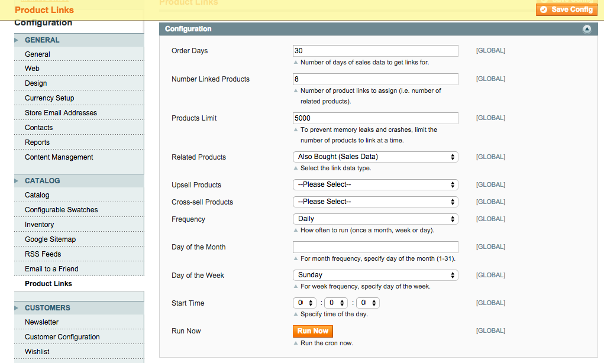

Product Links
=================

Description
-----------
Automate adding related, upsell and cross-sell links to your catalog based on most bought and most viewed.

How to use
-------------------------
Upload the files to the root of your Magento install. Let the install script run. This will create the table
aydus_productlinks_log for logging purposes. In the System -> Configuration,
go to Catalog -> Product Links and select the type of link data to add as related, upsell or cross-sell. 
Clear cache. Also set the time you want your cron to run.

